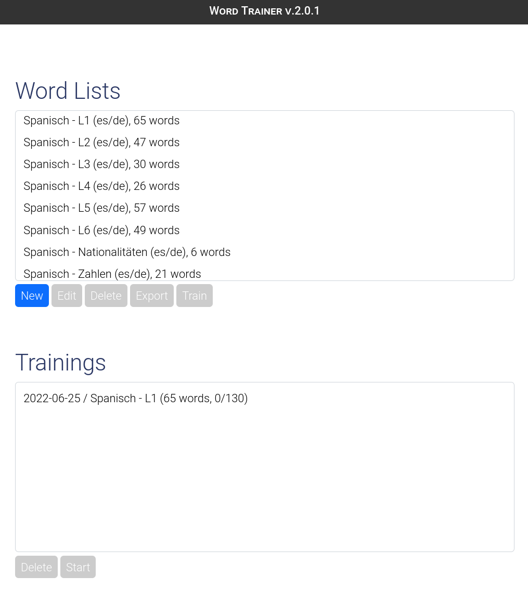
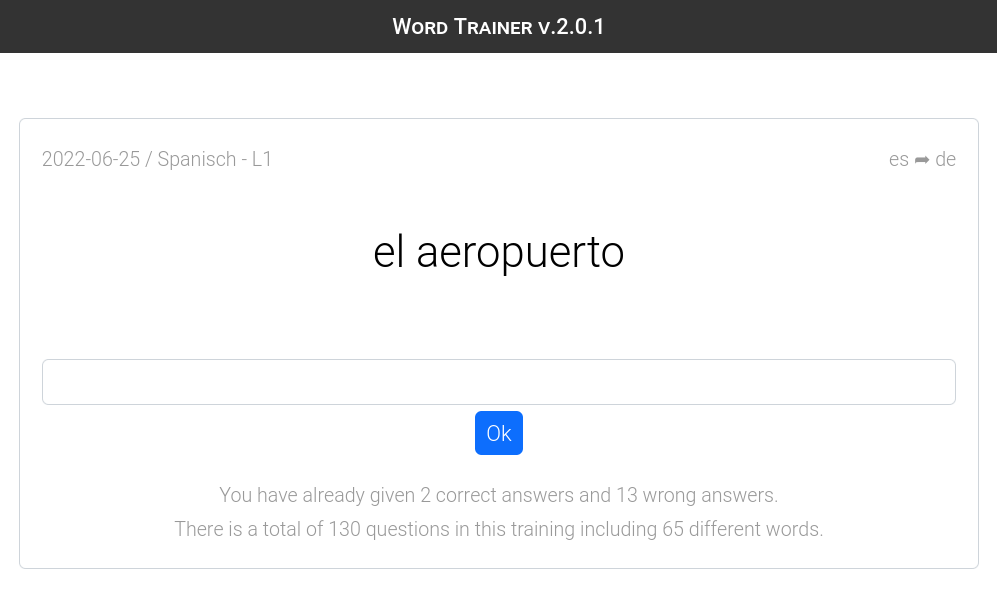

# Word Trainer

This is a simple word trainer written in PHP which can be used to learn vocabularies with self-defined word lists.

## Requirements
* Apache Webserver with PHP > 7.4
* MariaDB database

## Installation

* Copy all files within [www/](www/) subfolder to webserver root
* Enter database connection details in the [config.php](www/config.php) file
* (Optional) adjust the `RewriteBase /` directive in [.htaccess](www/.htaccess) if files are not installed at the web root

## Run tests

* Copy [test/](test/) folder to webserver root
* Execute `php test_database.php`

## Screenshots

